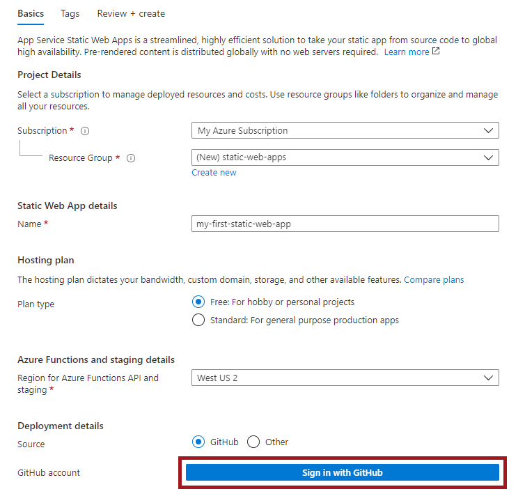

# Creating your website

Now that you have your basic resume crafted in [HTML](./create-html.md) and [CSS](./add-style.md), let's work on putting your resume on a website. To do this, we'll use a feature called GitHub Pages, which allows you to create a website directly from a repository on GitHub. 

## Commit your changes

The first thing we need to do is commit the changes we've made to our **resume** repository to GitHub. This will upload all of the resume content that we added to our repository, so we can use it for our website.

1. Select the **Source Control** icon on the left-hand side Activity Bar. There should be a small blue circle with a number inside, indicating the number of files you've made changes to since the last time you committed your code. 
1. Hover over the word **Changes**, and select the **+** button to Stage All Changes. All of the changes you stage will be committed. 
1. Write a message to go along with your commit. Something like "Add resume content" works great. 
1. Select the check mark icon at the top of the Source Control pane. This will commit your changes to your repository. 

## Set up Azure Static Web Apps via Portal

Next, we'll need to turn on SWA for our **resume** repository.
1. Navigate to the Azure portal.
1. Select Create a Resource.
1. Search for Static Web Apps.
1. Select Static Web Apps.
1. Select Create.

1. After you sign in with GitHub, enter the repository information.

1. Select Custom from the Build Presets dropdown.
1. Type ./src in the App location box.
1. Leave the Api location box empty.
1. Type ./src App artifact location box.
1. Select Review + create.

The Static Web Apps Overview window displays a series of links that help you interact with your web app. Once GitHub Actions workflow is complete, select on the URL link to open the website in new tab.

## Quiz

Try this quick quiz to check your knowledge

Q1: What does HTML stand for?
- a. Hypertext Markdown Language
- b. Hypotext Markup Language
- c. Hypertext Markup Language

Q2: HTML pages normally include the following main tags:
- a. head, body, and tail
- b. html, head, body and tail
- c. html, head, and body

Q3: CSS is NOT used to manage:
- a. tag creation
- b. background color
- c. font size

## Summary

Congratulations! You have successfully created a resume website entirely in the browser using HTML, CSS, github.dev, and Static Web Apps! You can continue to grow your web development skills by modifying this page, or exploring [content on Microsoft Learn](https://docs.microsoft.com/learn/paths/web-development-101/?WT.mc_id=academic-51109-ornella).